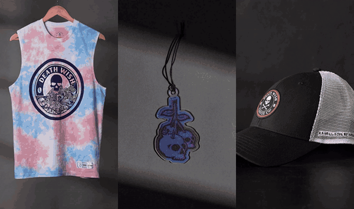
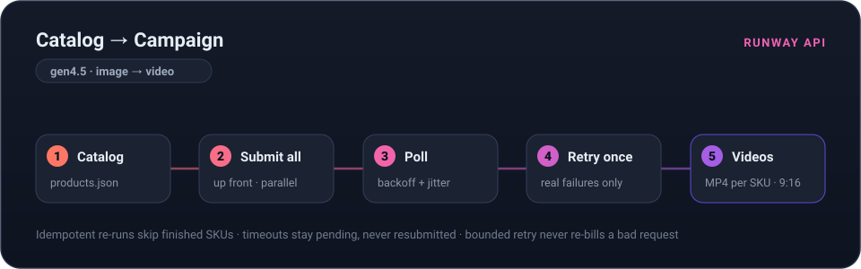

<div align="center">

# 🛍️ → 🎬 &nbsp;Catalog → Campaign

### Turn any Shopify catalog into platform-ready product videos, with one script and the [Runway API](https://dev.runwayml.com).

<br/>



<br/>
<sub><i>Real output from a real store: three products pulled straight from <a href="https://www.deathwishcoffee.com/">deathwishcoffee.com</a>'s public <code>products.json</code>, animated with <code>gen4.5</code>. Full-quality MP4s in <a href="examples/">examples/</a>.</i></sub>

<br/><br/>

[](https://www.python.org/)
[](https://docs.dev.runwayml.com)
[](LICENSE)
[](#contributing)

</div>

---

Point it at a store. It pulls each product's photo, animates it with `gen4.5` (**your catalog shot is the anchor frame, so the product stays true, no hallucinated variants**), and exports a Reels-ready 9:16 video per product.

**Your first run:** about ten minutes. A 5-second clip is 60 credits (**~$0.60**), so the [$10 minimum credit purchase](https://docs.dev.runwayml.com/guides/pricing/) covers around 16 product videos. <!-- gen4.5 = 12 credits/sec, $0.01/credit, per docs.dev.runwayml.com/guides/pricing -->

## ⚡ Quickstart

```bash
git clone https://github.com/fabriciocarraro/runway-shopify-pipeline && cd runway-shopify-pipeline
pip install -r requirements.txt
cp .env.example .env     # add your API key → get one at https://dev.runwayml.com

python catalog_to_video.py --catalog sample_catalog.json --dry-run    # sanity check: runs with no key, spends nothing
python catalog_to_video.py --store yourstore.myshopify.com --skus 5   # the real thing: YOUR products, moving
```

That second command is the whole point: most Shopify stores expose `products.json` publicly, so this runs against **your real catalog** with zero app installs and zero auth dances.

What a run looks like:

```text
🛍  Fetching catalog from yourstore.myshopify.com …
   3 of 3 products to generate · 5s each · est. ~180 credits (~$1.80)

  🚀 submitted retro-runner-sneaker  (task 21dcba8c…)
  🚀 submitted soy-candle-cedar  (task 0a4214c4…)
  🚀 submitted steel-bottle-750ml  (task 9f9086d4…)

  ✅ retro-runner-sneaker.mp4
  ✅ soy-candle-cedar.mp4
  ✅ steel-bottle-750ml.mp4

🎬 3 videos · 6m42s wall-clock · ~180 credits (~$1.80)

📣 Tweet-ready: "I turned yourstore.myshopify.com's catalog into 3 product videos in 6 minutes, for about $1.80. No shoot, no agency. One script."
```

> **Tip:** `--dry-run` previews any run, live store included, without spending a credit. To generate from `sample_catalog.json` for real, swap its placeholder URLs for public HTTPS product images first.

## 🧩 How it works

<div align="center">

</div>

1. **Catalog in.** `products.json` (or a local JSON file) → product title + first image, size-normalized through Shopify's CDN.
2. **Submit everything up front.** Every product's image→video task is submitted *before* any polling begins, so generations overlap on Runway's side instead of running one-by-one. How many render at once is governed by your account's [concurrency tier](https://docs.dev.runwayml.com/usage/tiers/).
3. **Poll with backoff.** One round-robin loop checks every pending task, backing off with jitter between sweeps (Runway's recommended ≥5s cadence).
4. **Bounded retry on real failures.** Terminal failures are often transient, so each *genuinely failed* task retries exactly once. The bound is deliberate: a truly bad request shouldn't re-bill forever. Tasks that are merely slow (still rendering at timeout) are **never** resubmitted, so nothing gets double-billed.
5. **Idempotent re-runs.** Already-rendered products are skipped, so a crash or a tweak never re-spends credits on finished work.

## ⚙️ Options

| Flag | Default | What it does |
|------|---------|--------------|
| `--store` / `--catalog` | *(required)* | Source: a live Shopify domain **or** a local catalog JSON (one required) |
| `--skus N` | `5` | How many products to animate |
| `--duration N` | `5` | Seconds per video (if Runway rejects a value, the error reply lists the accepted ones) |
| `--style X` | `studio` | Motion preset: `studio` · `lifestyle` · `dramatic` |
| `--ratio W:H` | `720:1280` | Output aspect ratio (9:16 by default) |
| `--out DIR` | `./output` | Where the MP4s land |
| `--timeout N` | *auto* | Max seconds to wait per poll batch (auto-scales with product count) |
| `--square` | off | Also export a 1:1 center-crop for feed (needs `ffmpeg`) |
| `--dry-run` | off | List what would be generated; spend nothing |

## 🎨 Style presets

| `studio` | `lifestyle` | `dramatic` |
|:--------:|:-----------:|:----------:|
| Slow push-in, soft studio light, clean background | Natural light, shallow depth of field, warm handheld drift | Dark background, sweeping rim light, slow orbit |

The presets live in [`styles.py`](styles.py) as a plain `name → prompt` dict. **Add your own by dropping a new entry in that file**: the CLI picks it up automatically, so your name becomes a valid `--style` choice with no other changes.

## 🛟 Troubleshooting

<details>
<summary><b>The store blocks <code>products.json</code> (403 / 404)</b></summary>

Some stores disable it. Use `--catalog your_file.json`; see [`sample_catalog.json`](sample_catalog.json) for the shape: `{"items": [{"sku", "title", "image"}]}` with public image URLs.
</details>

<details>
<summary><b>Runway returns a 400 on ratio or parameters</b></summary>

Read the response body, not just the status code: Runway's validation errors enumerate every accepted value inline. For `gen4.5` image→video the ratios are: `1280:720 1584:672 1104:832` (landscape), `720:1280 832:1104 672:1584` (portrait), `960:960` (square). That body is the source of truth.
</details>

<details>
<summary><b>Runway rejects your image</b></summary>

`prompt_image` must be a publicly reachable HTTPS image. The script requests `width=1280` from Shopify's CDN; adjust if your source images are unusually sized.
</details>

<details>
<summary><b>You hit the daily task limit (429)</b></summary>

That's an account-tier cap, not a bug: the script stops cleanly when it hits one instead of hammering. Generate in smaller `--skus` batches, or check your [usage tier](https://docs.dev.runwayml.com/usage/tiers/).
</details>

## 💡 Why this exists

Creative for online stores is a volume game now: paid social wants fresh assets every week, and the traditional pipeline (brief → shoot/agency → revisions) runs days-to-weeks per asset. But if your products live in a catalog, the brief already exists. This repo turns it into video.

## 🤝 Contributing

PRs welcome, especially new style presets. Fork, add your preset to the `STYLES` dict in [`styles.py`](styles.py), and open a PR.

## 📄 License

MIT. See [LICENSE](LICENSE).

<div align="center"><br/><sub>Built with the <a href="https://docs.dev.runwayml.com">Runway API</a>.</sub></div>
